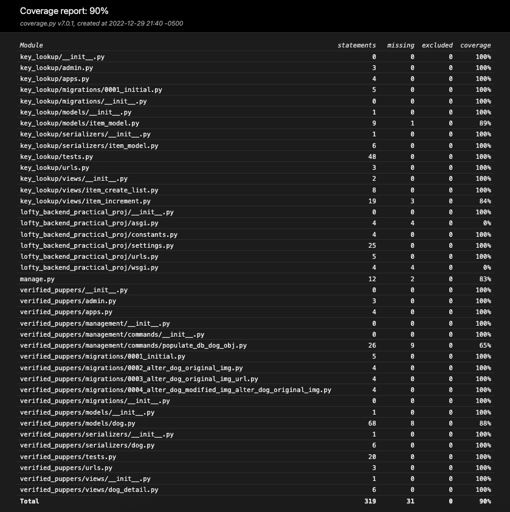

#  
# Backend Practical Test

### Submitted by: Austin McKee

Django web application that encompasses the following requirements:

	•	A dockerized Django app with a PostgreSQL database is required, any other tooling or libraries are your choice.
	•	An API endpoint that allows keys to be created as strings with a default integer value
	•	An API endpoint that increments the value of any given key
	•	An API endpoint to list all keys and their corresponding values
	•	An attempt should be made to update incremented values a minimum of 10 seconds, regardless of the number of requests or data currently being processed
	•	A service that populates the database with two dozen images of dogs and any corresponding metadata from the images
	•	An API endpoint that returns two images
        •	A visibly modified image of a dog
        •	The original image that was modified
        •	Any metadata present in the original image
	•	Test coverage over all code where it makes sense

## Test Coverage
90% Coverage



## Installation with Docker

Below we will walk through together how to create functional a development environment of the app

Ensure you have an updated version of [Docker](https://docs.docker.com/get-docker/) installed on your machine.

Clone this repo from the above links or by using GitHub CLI

GitHub CLI
```bash
gh repo clone amckee250/loftyBackendPractical
```

Once the repo is on your machine, open a terminal and navigate to the project. We will build a container to run the project in Docker
```bash
docker build .
```

Then we will start the application by using Docker Compose
```bash
docker compose up
```

Awesome! You should be seeing the Django application humming along in your terminal.

Navigate to the below address in the browser of your choice to view the app
```
http://127.0.0.1:8000/
```

Once the app is running, we will need to do a couple more django commands to prep the app for use

In a new terminal, find the name of the Docker container running this app using either of the below commands.
```bash
docker ps 
```
OR
```bash
docker container ls
```
Now we can use docker exec to apply terminal commands directly to the running Docker container
```bash
docker exec -it <NAME OF CONTAINER> <TERMINAL TYPE>
```
IE 
```bash
docker exec -it lofty_backend_practical_proj-web-1 bash
```

Once you have logged into the target container, we can now run the remaining Python commands to complete install

First, we need to build our database tables for the application to function. Use the below code to migrate the database
```python
python manage.py migrate
```

Second, we will want to create a Django superuser for our app. Follow the prompts to create a user.
```python
python manage.py createsuperuser
```

Great! Now you can login to the app at the below address
```
http://127.0.0.1:8000/admin
```
## Database Population Service
Per requirements, a service is included via a Django command to populate the database with two dozen images of dogs and any corresponding metadata from the images.

In your terminal, we will access the Docker container running our app again
```bash
docker exec -it <NAME OF IMAGE> <TERMINAL TYPE>
```
IE 
```bash
docker exec -it lofty_backend_practical_proj-web-1 bash
```

Once in the container terminal, we can then run the following command to populate the database with 24 images of dogs. Woof!
```bash
python manage.py populate_db_dog_obj
```

This command can be ran any amount of times to populate the database with 24 more images of dogs. If you would like to remove all Dog objects from the database and replace those with 24 new objects. The "--fresh_db true" flag can be used to do so.
```bash
python manage.py populate_db_dog_obj --fresh_db true
```


## API Documentation

This app is fully supported with API documentation using OpenAPI & Swagger.
With the application running, navigate to either of the below links to find full documentation of API endpoint usage

Swagger Docs
```
http://127.0.0.1:8000/swagger/
```

OpenAPI Docs
```
http://127.0.0.1:8000/redoc/
```


## Thank you's all around

Thank you for giving me the opportunity to prove some of the value I can bring to Lofty!

Please reach out if you have any questions, concerns, or would like me to walk you through any aspect of setup and use. I look forward to your thoughts and feedback.

Cheers to the New Year!

P.S. - I will be making this repo private once it is no longer in code review so your tests are not floating around the ether. :)
